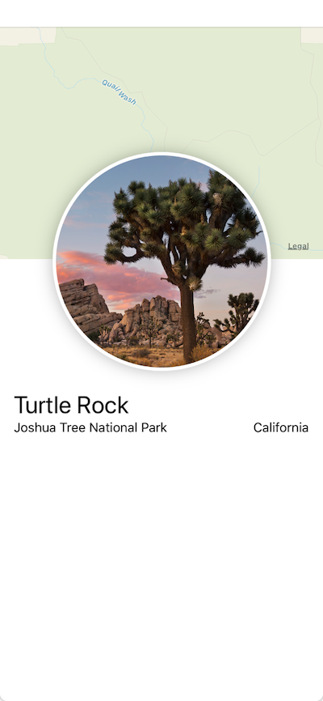
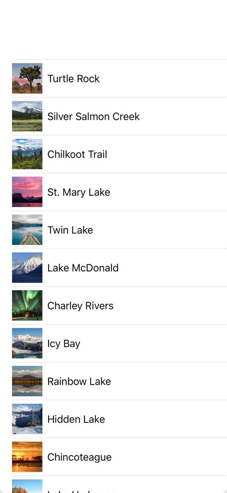
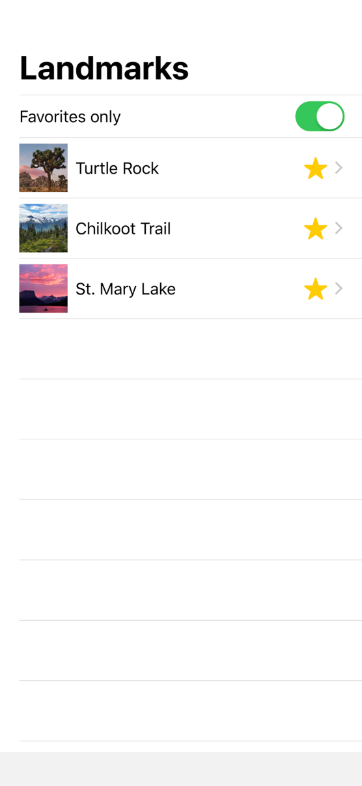
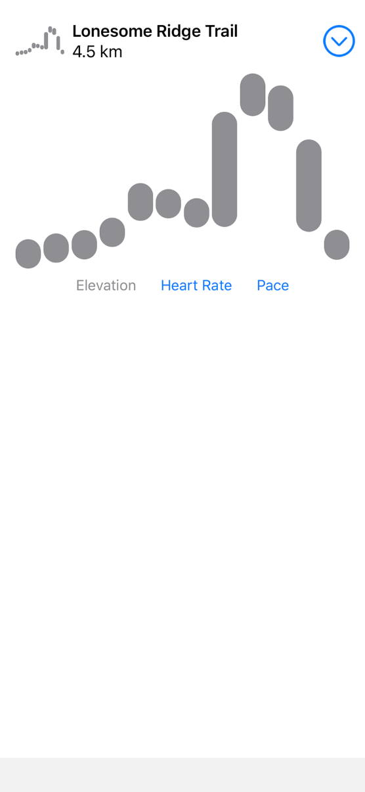
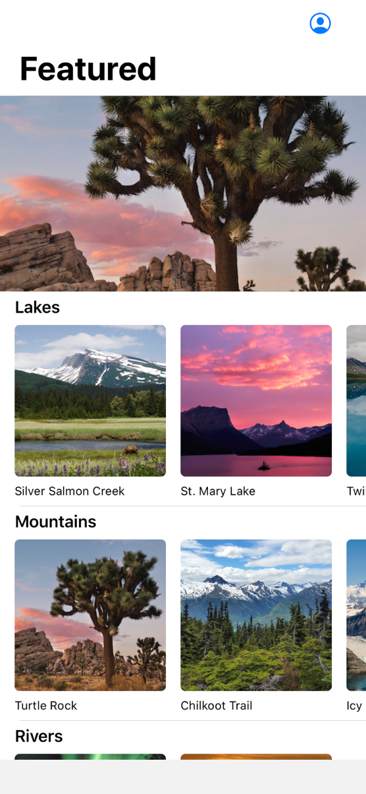
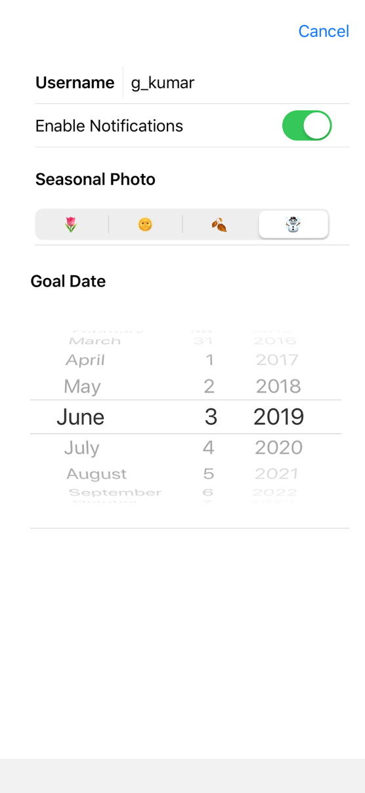

# awesome-swiftui

---

A curated list of awesome SwiftUI tutorials, libraries, sessions and articles.

## Contributing

Found a SwiftUI library or snippet that you think is *awesome*? Fork this repository and send your pull request.

## Index

  - [Websites](#websites) 
  - [Tutorials](#tutorials)
  - [Libraries](#libraries)
  - [Sessions](#sessions)
  - [Articles](#articles)

## Websites

* SwiftUI [https://developer.apple.com/xcode/swiftui/](https://developer.apple.com/xcode/swiftui/)
* Documentation [https://developer.apple.com/documentation/swiftui](https://developer.apple.com/documentation/swiftui)
* WWDC 2019 [https://developer.apple.com/wwdc19/](https://developer.apple.com/wwdc19/)

```
Apple Developer Program required.
```

* macOS Catalina 10.15 Beta [Install Profile](https://developer.apple.com/services-account/download?path=/WWDC_2019/macOS_10.15_Developer_Beta_Access_Utility/macOSDeveloperBetaAccessUtility.dmg)
* iOS 13 Beta [Download Restore Images](https://developer.apple.com/download/#ios-restore-images-iphone-new)
* iPadOS 13 Beta [Download Restore Images](https://developer.apple.com/download/#ios-restore-images-iphone-new)
* watchOS 6 Beta [Install Profile](https://developer.apple.com/services-account/download?path=/WWDC_2019/watchOS_6_beta_Configuration_Profile/watchOS_6_Beta_Profilemobileconfig.mobileconfig)
* Xcode 11 Beta [Download](https://developer.apple.com/services-account/download?path=/WWDC_2019/Xcode_11_Beta/Xcode_11_Beta.xip)

## Tutorials

| Link                                                         | Snapshot                                                     |
| ------------------------------------------------------------ | ------------------------------------------------------------ |
|  [Creating and Combining Views](https://developer.apple.com/tutorials/swiftui/creating-and-combining-views) |  |
|  [Building Lists and Navigation](https://developer.apple.com/tutorials/swiftui/building-lists-and-navigation) |  |
|  [Handling User Input](https://developer.apple.com/tutorials/swiftui/handling-user-input) |  |
|  [Drawing Paths and Shapes](https://developer.apple.com/tutorials/swiftui/drawing-paths-and-shapes) |  |
|  [Animating Views and Transitions](https://developer.apple.com/tutorials/swiftui/animating-views-and-transitions) |  |
|  [Composing Complex Interfaces](https://developer.apple.com/tutorials/swiftui/composing-complex-interfaces) |  |
|  [Working with UI Controls](https://developer.apple.com/tutorials/swiftui/working-with-ui-controls) |  |
|  [Interfacing with UIKit](https://developer.apple.com/tutorials/swiftui/interfacing-with-uikit) |  |


## Libraries

| Repo                                                         | Snapshot                                                     |
| ------------------------------------------------------------ | ------------------------------------------------------------ |
| [devxoul/SwiftUITodo](https://github.com/devxoul/SwiftUITodo) |  |
| [marty-suzuki/GitHubSearchWithSwiftUI](https://github.com/marty-suzuki/GitHubSearchWithSwiftUI) |  |
| [ra1028/SwiftUI-Combine-Example](https://github.com/ra1028/SwiftUI-Combine-Example) |  |
| [nataliemarleny/SwiftUI](https://github.com/nataliemarleny/SwiftUI) |  |
| [timdonnelly/SwiftUITimeTravel](https://github.com/timdonnelly/SwiftUITimeTravel) |                                                              |
| [alexpaul/SwiftUI-Landmarks](https://github.com/alexpaul/SwiftUI-Landmarks) |                                                              |
| [Yohrd/iOS-Portfolio-Rodrigo](https://github.com/Yohrd/iOS-Portfolio-Rodrigo) |                                                              |
| [ra1028/SwiftUI-Flux](https://github.com/ra1028/SwiftUI-Flux) |  |
| [unixzii/SwiftUI-2048](https://github.com/unixzii/SwiftUI-2048) |                                                              |
| [agiletalk/SwiftUINote](https://github.com/agiletalk/SwiftUINote)||


## Sessions

| Topic                                                        |
| ------------------------------------------------------------ |
| [Introducing SwiftUI: Building Your First App](https://developer.apple.com/videos/play/wwdc2019/204/) |
| [Accessibility in SwiftUI](https://developer.apple.com/videos/play/wwdc2019/238) |
| [Building Custom Views with SwiftUI](https://developer.apple.com/videos/play/wwdc2019/237) |
| [Data Flow Through SwiftUI](https://developer.apple.com/videos/play/wwdc2019/226) |
| [Integrating SwiftUI](https://developer.apple.com/videos/play/wwdc2019/231) |
| [Mastering Xcode Previews](https://developer.apple.com/videos/play/wwdc2019/233) |
| [SwiftUI Essentials](https://developer.apple.com/videos/play/wwdc2019/216) |
| [SwiftUI On All Devices](https://developer.apple.com/videos/play/wwdc2019/240) |
| [SwiftUI on watchOS](https://developer.apple.com/videos/play/wwdc2019/219) |

## Articles

| Topic                                                        |      |
| ------------------------------------------------------------ | ---- |
| 小专栏[@onevcat](https://xiaozhuanlan.com/u/onevcat) [SwiftUI 的一些初步探索 (一)](https://xiaozhuanlan.com/topic/7652341890) |      |
| Hacking with Swift [Get started with SwiftUI](https://www.hackingwithswift.com/articles/194/get-started-with-swiftui) |      |
| SwiftRocks [Inside SwiftUI's Declarative Syntax's Compiler Magic](https://swiftrocks.com/inside-swiftui-compiler-magic.html) |      |
| 知乎专栏[@黄二少碎碎念](https://zhuanlan.zhihu.com/hjcapple) [SwiftUI 的 DSL 语法分析](https://zhuanlan.zhihu.com/p/68294674) |      |
| WWDC by Sundell [A first look at SwiftUI: Apple's declarative new UI framework](https://wwdcbysundell.com/2019/swiftui-first-look/) |     |
| WWDC by Sundell [Answers to the most common questions about SwiftUI](https://wwdcbysundell.com/2019/swiftui-common-questions/) |      |
| Majid's [Making real-world app with SwiftUI](https://mecid.github.io/2019/06/05/swiftui-making-real-world-app/) |     |

